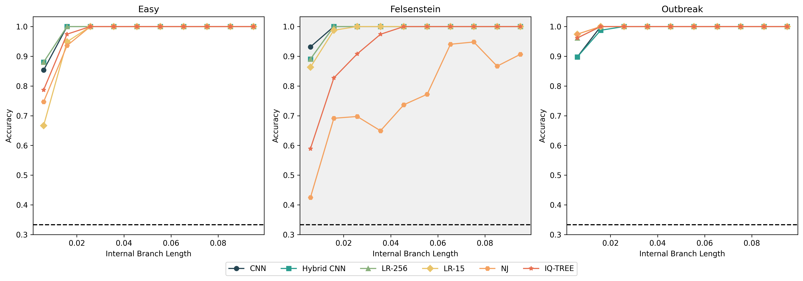

# Comparing Performance of Different ML Methods on Predicting Quartet Trees

**Does a CNN beat logistic regression on site-pattern frequencies at inferring
four-taxon phylogenetic trees, and does that answer change under model
misspecification or near-zero internal branch lengths?**

Short answer: No, under correct DNA substitution model specification the CNN does not beat logistic regression with site-pattern classifier, and it degrades more substantially under DNA substitution model misspecification than the classifier does. A hybrid CNN with the site-pattern knowledge attached to its features does not improve performance either.



## Report

Full writeup: [report/report.pdf](report/report.pdf). It includes the headline
finding, results by regime, and the misspecification analysis.


## What this is

Five tree inference methods: CNN, site-pattern logistic regression, a hybrid
of the two, maximum likelihood (IQ-TREE), and neighbor joining. I compare them a small phylogenetic problem: four taxa, three possible
unrooted topologies. I evaluate the methods across three evolutionary regimes (easy,
Felsenstein zone, outbreak-like) and under two different DNA substitution-models (train on JC69, test GTR+Γ).

## Package layout

```
quartet_ml/
  simulate/    tree generation, AliSim wrappers, regime definitions
  features/    site-pattern extraction (256-dim and 15-dim collapsed)
  train/       CNN, hybrid, logistic regression
  baselines/   IQ-TREE and ape::nj() wrappers (R)
  evaluate/    accuracy, confusion matrices, calibration, bootstrap CIs
report/        report.qmd (4-6 page writeup)
tests/         pytest suite
```

## Setup

Requires Python >= 3.10, R with the `ape` package, and IQ-TREE (bundles
AliSim; ships as the `iqtree3` binary).

```bash
python3 -m venv .venv
source .venv/bin/activate
pip install -e ".[dev]"
```

R dependency:

```r
install.packages("ape")
```

IQ-TREE, via conda/bioconda:

```bash
conda create -n quartet-ml -c bioconda -c conda-forge iqtree -y
conda activate quartet-ml
```

**Note:** the Homebrew `iqtree3` bottle (both Intel and native arm64 builds)
hangs indefinitely on AliSim on macOS 14.3.1/arm64 as of 2026-08. The
process enters an uninterruptible-wait state. The bioconda build
(3.1.3) does not have this problem and is what's actually used here.

Any code that shells out to `iqtree3` (`quartet_ml/simulate/`,
`quartet_ml/baselines/`, and anything that calls into them, e.g.
`evaluate_iqtree.py`) needs that binary on `PATH`. **Don't**
`conda activate quartet-ml` to get it. That env only has `iqtree` installed,
not this project's Python dependencies, so it would swap away your `.venv`'s
packages. Instead, with `.venv` already activated, append the conda env's
`bin` directory to `PATH`:

```bash
export PATH="$PATH:$HOME/miniconda3/envs/quartet-ml/bin"
```

Append, not prepend. `.venv/bin` stays first, so `python` still resolves to
your venv, and `iqtree3` is only picked up once nothing earlier on `PATH` has
it. This only lasts the current terminal session; re-run it (or add it to
your shell profile) each time you open a new one.

## Usage

```bash
quartet-ml --help
```

Training, evaluation, and plotting are run directly via the standalone
scripts at the repo root (`evaluate_cnn.py`, `evaluate_lr.py`,
`evaluate_nj.py`, `evaluate_iqtree.py`, `evaluate_hybrid_cnn.py`,
`report/plot_headline_figure.py`) rather than as CLI subcommands.

## Tests

```bash
pytest
```
